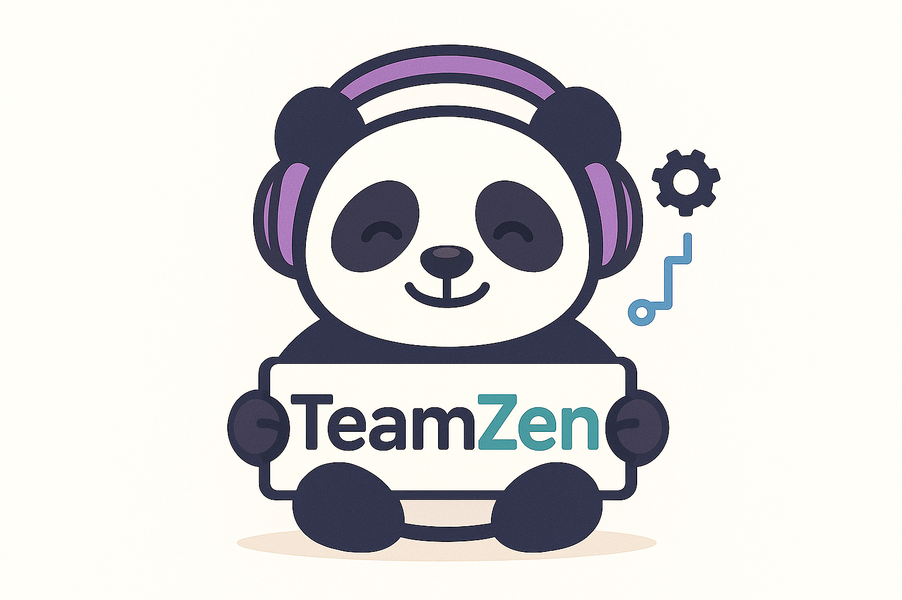

# 🧘‍♂️ TeamZen

<div align="center">
  
  
  <h3>Equipos más saludables, trabajo más productivo</h3>
  
  [](https://akabenjaboi.github.io/LandingPageOficial/)
  [](https://reactjs.org/)
  [](https://vitejs.dev/)
  [](https://supabase.com/)
  [](https://tailwindcss.com/)
  
</div>

## ✨ Sobre TeamZen

**TeamZen** es una plataforma web moderna para la **evaluación y prevención del síndrome de burnout** en equipos de trabajo, basada en el **Maslach Burnout Inventory (MBI)** - el estándar psicométrico más reconocido a nivel mundial.

### 🎯 **¿Por qué TeamZen?**

- 📊 **Científicamente validado**: Implementa los rangos oficiales del MBI con escalas 0-6
- 🤖 **IA integrada**: Análisis inteligente de tendencias con Groq (Llama 3.1)
- 📈 **Reportes estratégicos**: Visualización de evolución histórica y pronósticos
- 🔐 **Seguro y privado**: Autenticación robusta con Row Level Security (RLS)
- 🎨 **UX moderna**: Interfaz intuitiva con animaciones fluidas
- 💰 **Costo-efectivo**: Alternativa accesible a consultorías especializadas

---

## 🚀 Características principales

### 📋 **Evaluación MBI completa**
- ✅ 22 ítems estándar en 3 dimensiones: Agotamiento Emocional, Despersonalización, Realización Personal
- ✅ Escala oficial 0-6 (Nunca → Todos los días)
- ✅ Rangos de burnout: Bajo, Medio, Alto según literatura científica
- ✅ Diagnóstico automático de síndrome de burnout

### 👥 **Gestión de equipos**
- 🔗 Creación de equipos con códigos de invitación
- 📊 Ciclos de evaluación configurables
- 👤 Roles diferenciados (Líder/Miembro)
- 📧 Sistema de invitaciones integrado

### 📈 **Análisis avanzado**
- 📊 **Reportes comparativos** entre ciclos
- 🔄 **Análisis de tendencias** histórico
- 🎯 **Métricas de bienestar** sintéticas (0-100)
- 📉 **Gráficos interactivos** de evolución

### 🤖 **Inteligencia artificial**
- 🧠 **Motor heurístico local**: Sugerencias basadas en reglas psicológicas
- 🌟 **IA externa (Groq)**: Análisis evolutivo avanzado con Llama 3.1
- 🔮 **Pronósticos**: Predicción de tendencias futuras
- 💡 **Recomendaciones personalizadas**: Acciones específicas por equipo

---

## 🛠️ Stack tecnológico

### **Frontend**
- ⚛️ **React 19.1** - Framework UI moderno
- ⚡ **Vite 6.3** - Build tool ultra-rápido
- 🎨 **TailwindCSS 4.1** - Diseño utilitario
- 🎭 **Framer Motion** - Animaciones fluidas
- 🌐 **React Router 7.6** - Navegación SPA

### **Backend & Database**
- 🗄️ **Supabase** - Backend-as-a-Service
- 🐘 **PostgreSQL** - Base de datos relacional
- 🔐 **Row Level Security** - Seguridad a nivel de fila
- 🔑 **JWT Authentication** - Autenticación moderna

### **IA & Análisis**
- 🤖 **Groq API** - Inferencia de IA rápida
- 🦙 **Llama 3.1-8B** - Modelo de lenguaje avanzado
- 📊 **Algoritmos heurísticos** - Fallback local
- 📈 **Análisis psicométrico** - Clasificación MBI

### **DevOps & Deploy**
- 📦 **GitHub Pages** - Hosting estático
- 🔄 **GitHub Actions** - CI/CD automático
- 📝 **ESLint** - Linting de código
- 🎯 **Vite Build** - Optimización de producción

---

## 🚦 Quick Start

### **Prerrequisitos**
- Node.js 18+ 
- npm o yarn
- Cuenta en Supabase
- API Key de Groq (opcional)

### **1. Clonar repositorio**
```bash
git clone https://github.com/akabenjaboi/LandingPageOficial.git
cd LandingPageOficial/TeamZen
```

### **2. Instalar dependencias**
```bash
npm install
```

### **3. Configurar variables de entorno**
```bash
cp .env.example .env
```

Edita `.env` con tus credenciales:
```env
VITE_SUPABASE_URL=tu_supabase_url
VITE_SUPABASE_ANON_KEY=tu_supabase_anon_key
VITE_AI_PROXY_URL=tu_proxy_groq_opcional
```


### **4. Ejecutar en desarrollo**
```bash
npm run dev
```

🎉 **¡Listo!** Abre http://localhost:5173

---

## 📊 Funcionalidades clave

### **🔬 Evaluación científica del burnout**
- **Maslach Burnout Inventory (MBI)**: 22 ítems en 3 dimensiones oficiales
- **Clasificación automática**: Rangos Bajo/Medio/Alto según literatura científica  
- **Diagnóstico de síndrome**: Detección automática basada en criterios psicométricos

### **🤖 Sistema dual de análisis IA**
- **🧠 Motor heurístico local**: Sugerencias instantáneas basadas en reglas psicológicas
- **🌟 IA externa (Groq)**: Análisis evolutivo avanzado con Llama 3.1 y pronósticos


## 🔐 Seguridad y privacidad

- 🔒 **Row Level Security (RLS)**: Cada usuario solo ve sus datos
- 🔑 **JWT Authentication**: Tokens seguros con Supabase Auth
- 🌐 **HTTPS obligatorio**: Toda comunicación encriptada
- ✅ **Validación robusta**: Client-side y server-side


**Hecho con ❤️ y ☕ para equipos más saludables**

[🌐 Demo Live](https://akabenjaboi.github.io/LandingPageOficial/)

</div>
